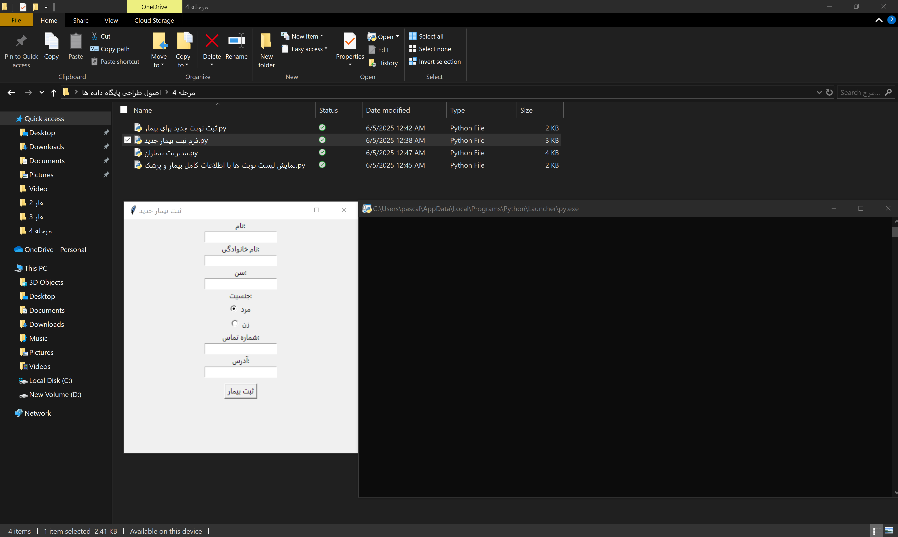
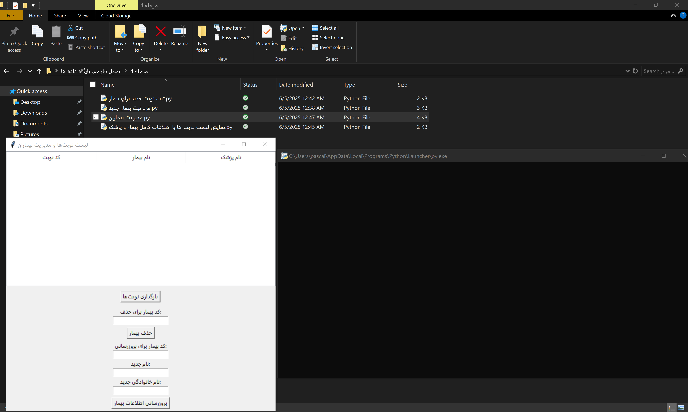
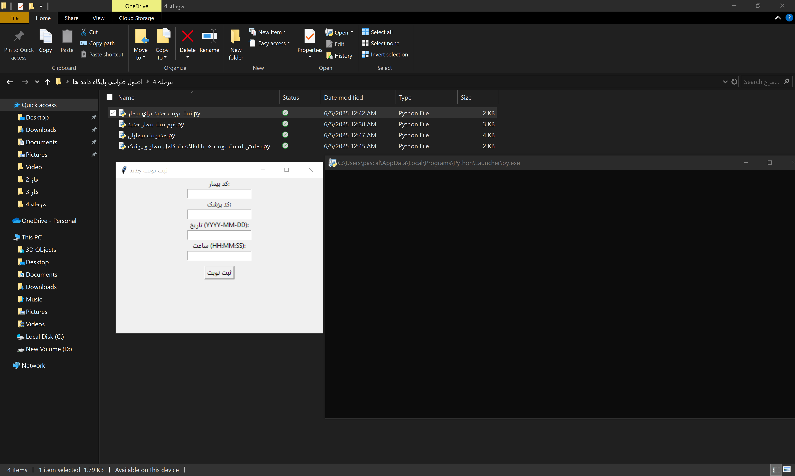
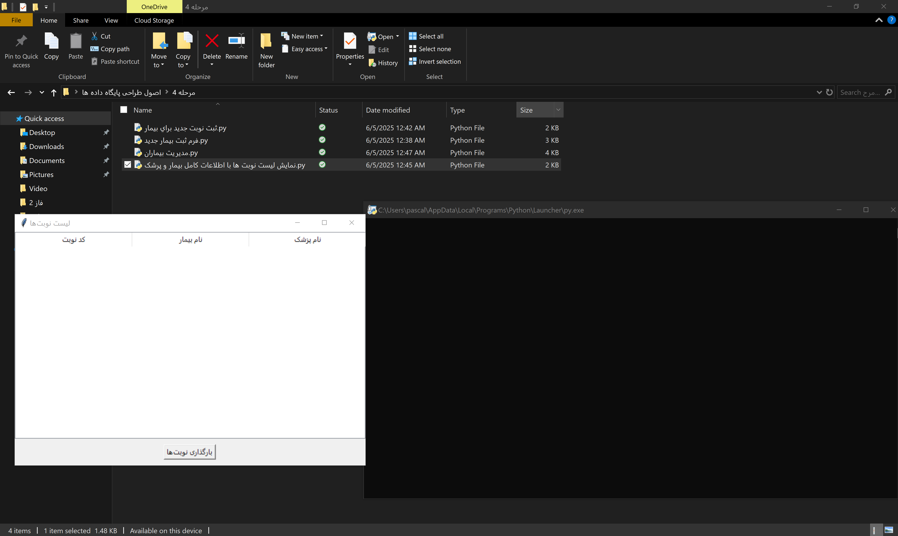

# Hospital Management System – Phase 4

## 📖 Project Overview

This project is a hospital management system developed as part of a database course final project. It includes the ability to register patients, schedule appointments, view records, and edit or delete data using a Python GUI connected to a Microsoft SQL Server database.

## 💻 Technologies Used

* Python (with Tkinter for GUI)
* Microsoft SQL Server
* SQL (T-SQL queries)
* pyodbc library (for database connection)
* GitHub (for version control and publishing)

## 🧩 Project Structure

* `register_patient.py` – Form to add new patients
* `appointment.py` – Schedule a new appointment
* `view_appointments.py` – View list of scheduled appointments using JOIN
* `update_delete_patient.py` – Edit or delete patient records
* `hospital.sql` – SQL script to create tables and insert sample data

## 🛠️ How to Run the Project

1. Clone or download this repository.
2. Open SQL Server Management Studio (SSMS) and run `hospital.sql` to create the database.
3. Install required Python libraries:

   ```bash
   pip install pyodbc
   ```
4. Open each Python file (e.g., `register_patient.py`) and run it with Python 3.

## 📸 Screenshots

## 📸 Screenshots

### 🔹 ثبت نام بیمار جدید


### 🔹 مدیریت بیماران (ویرایش / حذف)


### 🔹 ثبت نوبت جدید برای بیمار


### 🔹 نمایش لیست نوبت‌ها با اطلاعات کامل بیمار و پزشک


### 🔹 اجرای کوئری SELECT در SQL Server


### 🔹 اجرای کوئری INSERT در SQL Server


### 🔹 اجرای کوئری UPDATE در SQL Server


## 📄 License

This project is developed for academic and educational purposes only.

---

> Developed by: \[MohammadJavadGhaedi]
> Course: Database Systems – Final Project
> Phase 4: Implementation and Deployment
